# 🚀 Altitude HR — AI-Powered Candidate Search & Resume Intelligence


[](https://nextjs.org/)
[](https://react.dev/)
[](https://www.typescriptlang.org/)
[](https://tailwindcss.com/)
[](https://www.trychroma.com/)
[](https://js.langchain.com/)
[](https://www.mongodb.com/)
[](https://aws.amazon.com/s3/)

**Altitude HR** is a vector-powered recruiting intelligence platform designed for modern talent acquisition and recruitment teams. Instead of manually sifting through hundreds of static PDF resumes or relying on brittle keyword searches, Altitude HR leverages contextual vector embeddings, semantic search, and large language models (LLMs) to match and rank top candidates in seconds.

---

## ✨ Key Features

### 🔍 Contextual Vector Resume Search
- **Semantic Natural Language Search**: Query candidate pools using plain English (e.g., *"Senior Frontend Architect with Next.js and Design Systems expertise"* or *"Go developer with Kubernetes and distributed systems experience"*).
- **Match Scoring**: Every retrieved candidate is evaluated and assigned an intuitive match score (0–100%) with dynamic color badges and visual progress meters.

### 📄 Automated Resume Ingestion & Processing
- **Direct PDF Upload via S3**: Multi-file drag-and-drop resume upload powered by AWS S3 presigned URLs for fast and secure client-to-cloud uploads.
- **Serverless Text Extraction**: Automated PDF parsing and text extraction using `pdf-parse` with Node.js polyfill support.
- **Intelligent Resume Validation**: AI classification pipeline checks whether uploaded files are genuine resumes or CVs before indexing.
- **Document Chunking & Vector Indexing**: Automatic chunking with LangChain's `RecursiveCharacterTextSplitter`, OpenAI embedding generation, and high-dimensional vector storage in ChromaDB.

### 🎯 Structured Candidate Profile Cards
- **Instant Candidate Insights**: View candidate name, professional headline, AI-generated summary, top skills tags, and relevant work experiences directly in the chat.
- **One-Click PDF Download**: Directly download original candidate resume files from secure cloud storage.

### 💬 Multi-Session Chat & Recruitment Threads
- **Persistent Conversation Sessions**: All search queries and candidate match responses are saved to MongoDB using Prisma ORM with transactional integrity.
- **Session Management**: Rename, delete, and switch between previous recruitment searches with an interactive sidebar.

### 🔐 Authentication & Access Control
- **Google OAuth 2.0 Integration**: One-click login with Google OAuth via `@react-oauth/google` and server-side JWT session cookies.

### 💳 Monetization & Billing
- **DodoPayments Integration**: Seamless checkout sessions and webhook handling supporting both test and live environments.

### 🎨 State-of-the-Art User Experience
- **Fluid Visuals & Micro-Animations**: Built with Tailwind CSS v4, Motion (Framer Motion), interactive WebGL Cloud Shader hero background, and Aceternity Bento Grid design.
- **Modern Component Architecture**: Built on top of accessible Radix / Shadcn / Base UI primitives and Lucide icons.

---

## 🏗️ Architecture & Workflow

```mermaid
flowchart TD
    subgraph Resume Ingestion Pipeline
        A[User Uploads PDF] --> B[AWS S3 Presigned URL]
        B --> C[PDF Text Extraction & Polyfills]
        C --> D[AI Resume Suitability Verification]
        D --> E[Recursive Character Text Splitter]
        E --> F[OpenAI Vector Embeddings]
        F --> G[(ChromaDB Vector Store)]
        F --> H[(MongoDB / Prisma Document Registry)]
    end

    subgraph Candidate Match & Chat Pipeline
        I[User Search Prompt] --> J[AI Search Intent Verification]
        J --> K[OpenAI Query Embedding]
        K --> L[ChromaDB Nearest Neighbor Query]
        L --> M[Structured OpenAI LLM Matcher]
        M --> N[Candidate Cards & Match Scores]
        N --> O[(MongoDB Chat Session & History)]
        N --> P[Interactive Chat UI & PDF Download]
    end
```



---

## 🛠️ Tech Stack

| Domain | Technology |
|---|---|
| **Framework** | [Next.js 16](https://nextjs.org/) (App Router, Turbopack, React 19) |
| **Language** | [TypeScript](https://www.typescriptlang.org/) |
| **Styling & UI** | [Tailwind CSS v4](https://tailwindcss.com/), [Shadcn UI](https://ui.shadcn.com/), [Base UI](https://base-ui.com/), [Lucide Icons](https://lucide.dev/) |
| **Animations** | [Motion](https://motion.dev/), Custom GLSL Cloud Shader |
| **State Management** | [Redux Toolkit](https://redux-toolkit.js.org/), [TanStack Query v5](https://tanstack.com/query/latest) |
| **Vector DB** | [ChromaDB](https://www.trychroma.com/) |
| **AI / LLM** | [LangChain](https://js.langchain.com/), [OpenAI API](https://openai.com/) |
| **Database & ORM** | [MongoDB](https://www.mongodb.com/), [Prisma 8 ORM](https://www.prisma.io/) |
| **Cloud Storage** | [AWS S3](https://aws.amazon.com/s3/) (`@aws-sdk/client-s3`) |
| **Payments** | [DodoPayments SDK](https://dodopayments.com/) |
| **Authentication** | [Google OAuth 2.0](https://developers.google.com/identity), JWT (`jsonwebtoken`) |

---

## 📁 Directory Structure

```plaintext
candidatefinder/
├── migrations/                # Database migrations
├── public/                    # Static assets & icons
├── scripts/                   # Helper & DNS configuration scripts
└── src/
    ├── app/
    │   ├── (auth)/login/      # Google OAuth login page
    │   ├── api/
    │   │   ├── auth/          # Google authentication routes & token exchange
    │   │   ├── candidatematch/# Candidate semantic vector search & LLM matching
    │   │   ├── chatsessions/  # Chat session management (CRUD)
    │   │   ├── checkout/      # DodoPayments checkout session endpoint
    │   │   ├── getchats/      # Message history retrieval by session ID
    │   │   ├── resumes/       # Presigned upload URLs, download & text extraction
    │   │   └── webhook/       # DodoPayments webhook listener
    │   ├── chat/              # Main recruitment search & chat interface
    │   ├── layout.tsx         # Root layout with providers & SEO meta
    │   ├── page.tsx           # Modern landing page
    │   ├── providers.tsx      # Redux, React Query & Google Auth providers
    │   ├── robots.ts          # Search engine crawlers configuration
    │   └── sitemap.ts         # Dynamic XML sitemap generator
    ├── components/
    │   ├── custom/            # Custom application components (Sidebar, etc.)
    │   ├── ui/                # Base UI & Shadcn reusable UI components
    │   ├── cloud-shader-hero-demo.tsx # Interactive WebGL cloud background
    │   ├── landing-bento-features.tsx # Aceternity bento feature grid
    │   ├── pdf-upload-dialog.tsx      # Multi-file PDF upload modal
    │   └── structured-data.tsx        # JSON-LD SEO schema
    ├── features/              # Redux slices (User authentication & profile state)
    ├── interfaces/            # TypeScript data models & API contracts
    ├── lib/                   # API clients, S3, ChromaDB, OpenAI, Auth & Utilities
    ├── prisma/                # Prisma contract schema & Mongo client
    └── store/                 # Redux store configuration
```